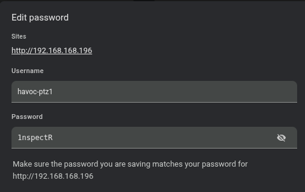

# Camera setup

1. Set camera gateway to match the starlink IP (192.168.168.XXX where XXX = vehicle number)

2. Set the camera IP address to 192.168.168.106

3. Set the camera RTP stream to TBD ~~192.168.0.55~~, port 6780

4. Set the camera Audio RTP stream to TBD ~~192.168.0.44~~ port ???

